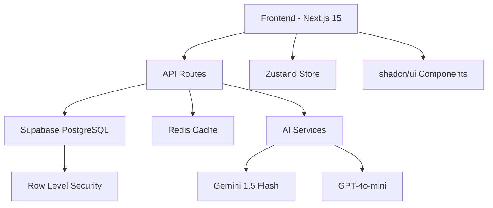
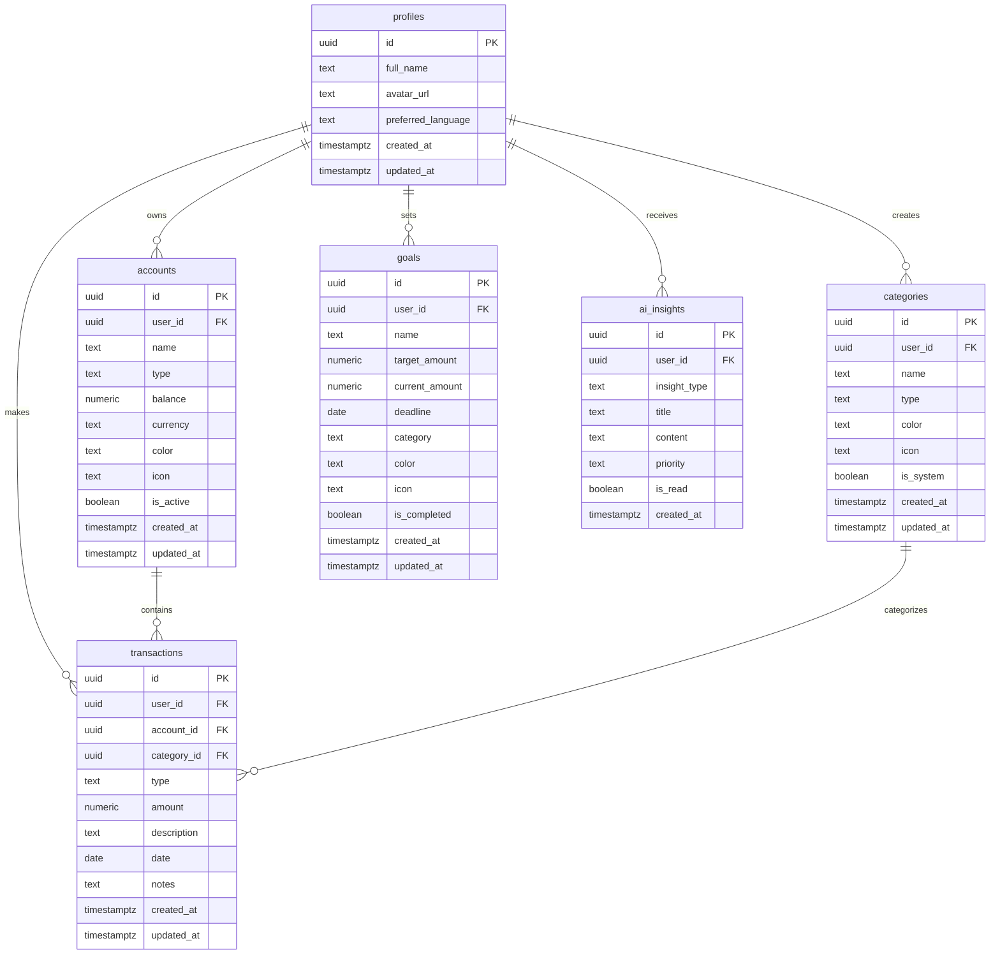

# 📐 Documentação Técnica - OrbiFinance MVP

> **Guia técnico completo para desenvolvedores**

## 🏗️ Arquitetura do Sistema

### Visão Geral

OrbiFinance segue uma arquitetura **full-stack moderna** com separação clara de responsabilidades:



### Stack Tecnológica Detalhada

| Camada            | Tecnologia        | Versão | Justificativa                            |
| ----------------- | ----------------- | ------ | ---------------------------------------- |
| **Frontend**      | Next.js           | 15.x   | App Router, SSR, performance otimizada   |
| **UI Framework**  | TailwindCSS       | 4.1    | Utility-first, design system consistente |
| **Componentes**   | shadcn/ui + Radix | Latest | Acessibilidade, customização             |
| **Estado Global** | Zustand           | 5.x    | Simples, performático, TypeScript        |
| **Validação**     | Zod               | 3.x    | Type-safe, runtime validation            |
| **Backend**       | Supabase          | Latest | PostgreSQL, Auth, RLS, real-time         |
| **Cache**         | Redis             | 7.x    | Sessions, AI response cache              |
| **IA Principal**  | Gemini 1.5 Flash  | Latest | Rápido, econômico, multilingual          |
| **IA Secundária** | GPT-4o-mini       | Latest | Análises complexas, fallback             |
| **Testes**        | Vitest            | 2.x    | Rápido, compatível com Vite              |
| **Linting**       | oxlint            | 0.41+  | Moderno, rápido, menos config            |

## 🗄️ Schema do Banco de Dados

### Diagrama ER



### Triggers e Funções

#### Atualização Automática de Metas

```sql
-- Trigger que atualiza progresso das metas automaticamente
CREATE OR REPLACE FUNCTION update_goal_progress()
RETURNS TRIGGER AS $$
DECLARE
    goal_record RECORD;
    category_sum NUMERIC(15, 2);
BEGIN
    FOR goal_record IN
        SELECT id, name, target_amount, category
        FROM public.goals
        WHERE user_id = COALESCE(NEW.user_id, OLD.user_id)
        AND is_completed = false
    LOOP
        -- Lógica de cálculo baseada na categoria da meta
        -- Ver scripts/005_create_goal_triggers.sql para implementação completa
    END LOOP;

    RETURN COALESCE(NEW, OLD);
END;
$$ LANGUAGE plpgsql;
```

## 🧠 Sistema de IA

### Estratégia de Seleção de Modelos

```typescript
export function shouldUseComplexAnalysis(transactions: any[], goals: any[]): boolean {
  return (
    transactions.length > 100 || // Muitas transações
    goals.length > 3 || // Múltiplas metas
    (transactions.length > 50 && goals.length > 1) // Cenário complexo
  )
}

export async function generateFinancialInsights(
  transactions: any[],
  goals: any[],
  options?: { language?: string; useComplex?: boolean }
): Promise<AIResponse> {
  // Usar GPT-4o-mini para análises complexas
  if (options?.useComplex) {
    return generateInsightsWithOpenAI(transactions, goals, options)
  }

  // Padrão: Gemini 1.5 Flash (80% dos casos)
  return generateInsightsWithGemini(transactions, goals, options)
}
```

### Tipos de Insights

```typescript
interface AIInsight {
  type: "spending_pattern" | "saving_tip" | "budget_alert" | "goal_progress" | "general"
  title: string // Max 60 chars
  content: string // Max 200 chars
  priority: "low" | "medium" | "high"
}
```

### Cache de Respostas IA

```typescript
// Redis cache para evitar chamadas desnecessárias
const cacheKey = `insights:${userId}:${transactionHash}`
const cachedInsights = await redis.get(cacheKey)

if (cachedInsights) {
  return JSON.parse(cachedInsights)
}

const insights = await generateFinancialInsights(transactions, goals)
await redis.setex(cacheKey, 3600, JSON.stringify(insights)) // 1 hora
```

## 🏪 Gerenciamento de Estado

### Zustand Store Structure

```typescript
// UI State Store - Estados de interface
interface UIState {
  // Modal states
  isTransactionModalOpen: boolean
  isAccountModalOpen: boolean

  // Global states
  isLoading: boolean
  isSidebarOpen: boolean
  isDarkMode: boolean
  currentLanguage: "en" | "pt" | "es"

  // Filters
  transactionFilters: TransactionFilters

  // Actions
  setTransactionModal: (open: boolean) => void
  setLoading: (loading: boolean) => void
  // ... outros actions
}

// Data Store - Dados da aplicação
interface DataState {
  // Data arrays
  accounts: Account[]
  categories: Category[]
  transactions: Transaction[]
  goals: Goal[]
  insights: AIInsight[]

  // Loading states
  accountsLoading: boolean
  transactionsLoading: boolean

  // CRUD Actions
  setAccounts: (accounts: Account[]) => void
  addAccount: (account: Account) => void
  updateAccount: (id: string, account: Partial<Account>) => void

  // Computed values
  totalBalance: () => number
  monthlyIncome: (month?: string) => number
  getAccountById: (id: string) => Account | undefined
}
```

### Quando Usar useState vs Zustand

```typescript
// ❌ Não use Zustand para estado local de componente
const [isOpen, setIsOpen] = useState(false) // ✅ Correto

// ❌ Não use useState para dados compartilhados
const { accounts, setAccounts } = useDataStore() // ✅ Correto

// ✅ Padrão OrbitMind: UI local = useState, Global = Zustand
```

## 🧪 Validação com Zod

### Schema de Transação

```typescript
export const CreateTransactionSchema = z.object({
  type: z.enum(["income", "expense", "transfer"]),
  amount: z.number().positive("Amount must be positive"),
  description: z.string().min(1, "Description is required").max(200),
  date: z.string().datetime().or(z.string().regex(/^\d{4}-\d{2}-\d{2}$/)),
  notes: z.string().max(500).optional(),
  account_id: z.string().uuid(),
  category_id: z.string().uuid(),
})

// Uso no componente
const { errors } = useForm({
  resolver: zodResolver(CreateTransactionSchema),
  defaultValues: { ... }
})
```

### Validação em API Routes

```typescript
export async function POST(request: Request) {
  try {
    const body = await request.json()

    // Validação obrigatória
    const validatedData = CreateTransactionSchema.parse(body)

    // Proceder com dados seguros
    const { error } = await supabase.from("transactions").insert(validatedData)
  } catch (error) {
    if (error instanceof z.ZodError) {
      return Response.json(
        {
          error: "Validation failed",
          details: error.errors,
        },
        { status: 400 }
      )
    }
  }
}
```

## 🧪 Estratégia de Testes

### Estrutura de Testes

```
tests/
├── components/           # Testes de componentes React
├── lib/                 # Testes de utilitários
├── api/                 # Testes de API routes
├── setup.ts             # Configuração global
└── mocks/               # Mocks reutilizáveis
```

### Mocks Essenciais

```typescript
// Mock Supabase Client
vi.mock("@/lib/supabase/client", () => ({
  createClient: () => ({
    auth: { getUser: vi.fn().mockResolvedValue({ data: { user: mockUser } }) },
    from: vi.fn(() => ({
      /* mock query builder */
    })),
  }),
}))

// Mock Next.js Navigation
vi.mock("next/navigation", () => ({
  useRouter: () => ({ push: vi.fn(), refresh: vi.fn() }),
  usePathname: () => "/dashboard",
}))
```

### Cobertura de Testes

```bash
# Executar com cobertura
pnpm run test:coverage

# Metas de cobertura
- Schemas: 100%
- Components críticos: 90%+
- API routes: 85%+
- Utilities: 95%+
```

## 🚀 Performance

### Otimizações Implementadas

#### 1. Bundle Splitting

```typescript
// next.config.mjs
experimental: {
  optimizePackageImports: ["@radix-ui/react-icons", "lucide-react"]
}
```

#### 2. Image Optimization

```typescript
// Componente otimizado
import Image from 'next/image'

<Image
  src="/dashboard-preview.jpg"
  alt="Dashboard"
  width={800}
  height={600}
  loading="lazy"
  placeholder="blur"
/>
```

#### 3. API Response Caching

```typescript
// Cache Redis para dados frequentes
const cacheKey = `user:${userId}:summary`
const cached = await redis.get(cacheKey)

if (!cached) {
  const data = await calculateUserSummary(userId)
  await redis.setex(cacheKey, 300, JSON.stringify(data)) // 5 min
  return data
}
```

#### 4. Database Query Optimization

```sql
-- Índices para performance
CREATE INDEX CONCURRENTLY idx_transactions_user_date
ON transactions(user_id, date DESC);

CREATE INDEX CONCURRENTLY idx_transactions_category_type
ON transactions(category_id, type);
```

### Métricas de Performance

| Métrica                  | Target  | Atual  |
| ------------------------ | ------- | ------ |
| First Contentful Paint   | < 1.5s  | ~1.2s  |
| Largest Contentful Paint | < 2.5s  | ~2.1s  |
| Time to Interactive      | < 3.5s  | ~2.8s  |
| Bundle Size (gzipped)    | < 200KB | ~185KB |

## 🔐 Segurança

### Row Level Security (RLS)

```sql
-- Política para transações (exemplo)
CREATE POLICY "Users can only access their own transactions"
ON transactions
FOR ALL
USING (auth.uid() = user_id);

-- Política para contas
CREATE POLICY "Users can manage their own accounts"
ON accounts
FOR ALL
USING (auth.uid() = user_id);
```

### Validação de Entrada

```typescript
// Sempre validar dados de entrada
export async function POST(request: Request) {
  const {
    data: { user },
  } = await supabase.auth.getUser()

  if (!user) {
    return Response.json({ error: "Unauthorized" }, { status: 401 })
  }

  const body = await request.json()
  const validatedData = CreateTransactionSchema.parse(body) // ✅ Validação obrigatória

  // Adicionar user_id automaticamente (nunca confiar no cliente)
  const transactionData = {
    ...validatedData,
    user_id: user.id, // ✅ Sempre do servidor
  }
}
```

### Sanitização de Dados

```typescript
// Limitar tamanhos máximos
const insightsToInsert = insights.map((insight) => ({
  user_id: user.id,
  insight_type: insight.type,
  title: insight.title.slice(0, 60), // ✅ Limite enforçado
  content: insight.content.slice(0, 200), // ✅ Limite enforçado
  priority: insight.priority,
}))
```

## 📱 Responsividade

### Breakpoints TailwindCSS

```typescript
// tailwind.config.js
module.exports = {
  theme: {
    screens: {
      sm: "640px", // Mobile landscape
      md: "768px", // Tablet
      lg: "1024px", // Desktop
      xl: "1280px", // Large desktop
      "2xl": "1536px", // Extra large
    },
  },
}
```

### Componentes Responsivos

```tsx
// Dashboard layout responsivo
<div className="grid gap-4 md:grid-cols-2 lg:grid-cols-3">
  <Card className="col-span-full md:col-span-1 lg:col-span-2">{/* Chart component */}</Card>
  <Card className="md:col-span-1">{/* Summary card */}</Card>
</div>
```

## 🌍 Internacionalização

### Estrutura de Mensagens

```json
// messages/en.json
{
  "dashboard": {
    "title": "Dashboard",
    "welcome": "Welcome back",
    "totalBalance": "Total Balance"
  },
  "transactions": {
    "title": "Transactions",
    "new": "New Transaction",
    "amount": "Amount"
  }
}
```

### Uso em Componentes

```tsx
import { useTranslations } from "next-intl"

function TransactionForm() {
  const t = useTranslations("transactions")

  return (
    <form>
      <Label>{t("amount")}</Label>
      <Input placeholder={t("amountPlaceholder")} />
    </form>
  )
}
```

### Formatação de Moeda

```typescript
// Utilitário de formatação
export function formatCurrency(amount: number, locale = "en-US", currency = "USD") {
  return new Intl.NumberFormat(locale, {
    style: "currency",
    currency,
  }).format(amount)
}

// Uso com i18n
const { locale } = useParams()
const formattedAmount = formatCurrency(transaction.amount, locale)
```

## 🐛 Debugging e Monitoramento

### Logs Estruturados

```typescript
// lib/logger.ts
export const logger = {
  info: (message: string, meta?: object) => {
    console.log(JSON.stringify({ level: "info", message, ...meta, timestamp: new Date().toISOString() }))
  },
  error: (message: string, error?: Error, meta?: object) => {
    console.error(
      JSON.stringify({
        level: "error",
        message,
        error: error?.message,
        stack: error?.stack,
        ...meta,
        timestamp: new Date().toISOString(),
      })
    )
  },
}

// Uso nas API routes
logger.info("Transaction created", { userId: user.id, transactionId: result.id })
logger.error("Failed to generate insights", error, { userId: user.id })
```

### Error Boundaries

```tsx
// components/error-boundary.tsx
export function ErrorBoundary({ children }: { children: React.ReactNode }) {
  return (
    <ErrorBoundaryWrapper
      fallback={(error) => (
        <div className="p-6 text-center">
          <h2>Algo deu errado</h2>
          <p>{error.message}</p>
          <Button onClick={() => window.location.reload()}>Tentar novamente</Button>
        </div>
      )}
    >
      {children}
    </ErrorBoundaryWrapper>
  )
}
```

## 🚀 Deploy

### Preparação para Produção

```bash
# Build do projeto
pnpm run build

# Verificações pré-deploy
pnpm run lint
pnpm run type-check
pnpm run test

# Otimizações
next build && next export  # Para deploy estático
```

### Variáveis de Ambiente Produção

```env
# Produção - valores obrigatórios
NODE_ENV=production
NEXT_PUBLIC_SUPABASE_URL=
NEXT_PUBLIC_SUPABASE_ANON_KEY=
SUPABASE_SERVICE_ROLE_KEY=
GOOGLE_GENERATIVE_AI_API_KEY=
DATABASE_URL=
REDIS_URL=
```

### Health Checks

```typescript
// app/api/health/route.ts
export async function GET() {
  try {
    // Verificar conexão com banco
    const { data } = await supabase.from("profiles").select("id").limit(1)

    // Verificar AI
    const aiStatus = getAIModelStatus()

    return Response.json({
      status: "healthy",
      timestamp: new Date().toISOString(),
      services: {
        database: "up",
        ai: aiStatus.gemini.available ? "up" : "degraded",
      },
    })
  } catch (error) {
    return Response.json(
      {
        status: "unhealthy",
        error: error.message,
      },
      { status: 500 }
    )
  }
}
```

---

## 📚 Referências Técnicas

### Links Úteis

- [Next.js 15 Docs](https://nextjs.org/docs)
- [Supabase Docs](https://supabase.com/docs)
- [TailwindCSS Docs](https://tailwindcss.com/docs)
- [Zustand Guide](https://github.com/pmndrs/zustand)
- [Zod Documentation](https://zod.dev/)
- [Vitest Guide](https://vitest.dev/)

### Padrões OrbitMind

1. **Clean Code**: Funções < 50 linhas, nomes descritivos
2. **TypeScript**: Tipagem estrita, sem `any`
3. **Componentes**: < 200 linhas, responsabilidade única
4. **Testes**: Cobertura > 80% em código crítico
5. **Performance**: Bundle < 200KB, FCP < 1.5s

---

<div align="center">
  <strong>📐 Documentação mantida pela equipe OrbitMind</strong>
</div>
